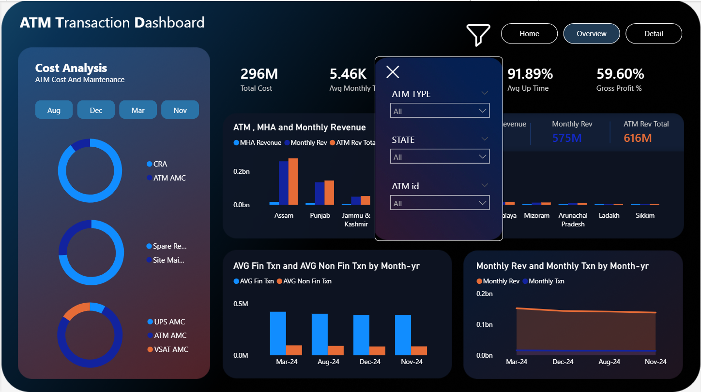
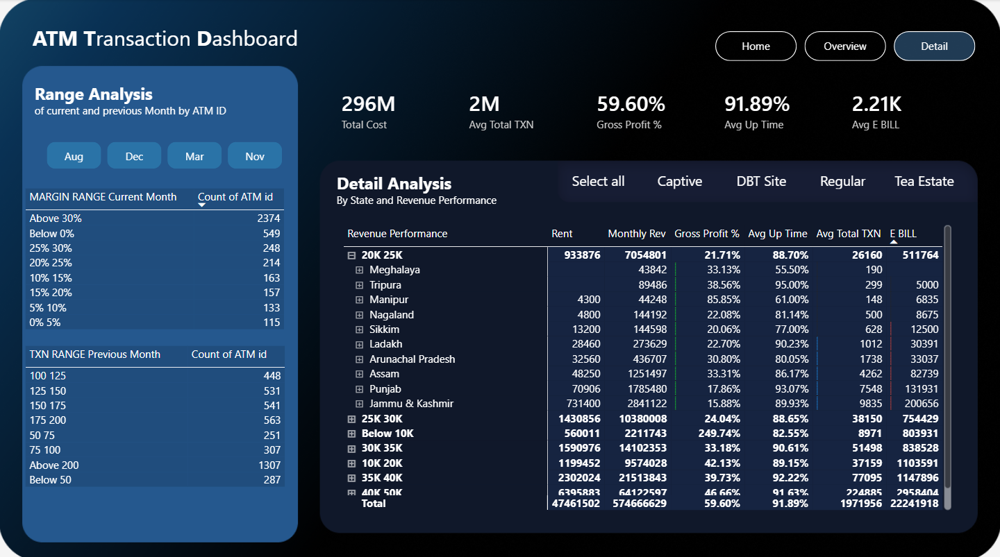

# 🏧 ATM Transaction Analytics Dashboard

## Project Overview
This project is a **Power BI dashboard for ATM transaction analysis**. It provides insights into ATM usage patterns, transaction volumes, revenue generation, and operational performance. The dashboard helps financial institutions and ATM operators make data-driven decisions by visualizing key metrics and trends interactively. 💳📊

---

## Features

- 🏦 **ATM Performance**: Analyze individual ATM transaction volumes, revenue, and uptime.
- 📍 **Geospatial Analysis**: View ATM performance by location with interactive maps.
- 📈 **Transaction Trends**: Track daily, weekly, and monthly transaction patterns.
- 💰 **Revenue Insights**: Monitor cash withdrawals, fees, and revenue generation.
- ⏰ **Peak Hours Analysis**: Identify high-usage periods and optimize cash management.
- 🔧 **Operational Metrics**: Track downtime, maintenance schedules, and service levels.
- 🔎 **Interactive Filters**: Filter data by region, ATM type, time period, and transaction type.

---

## Tools & Technologies

- 🖥 **Power BI Desktop**: Dashboard creation, interactive visuals, and reports.
- 📁 **Data Sources**: CSV/Excel files, SQL databases, or API integrations.
- 🧩 **Data Modeling**: Star schema design with fact and dimension tables.
- 📊 **DAX Formulas**: Custom calculations for KPIs and business metrics.
- 🗺 **GIS Integration**: Location-based analytics and mapping visualizations.

---

## Dashboard Highlights

- 📊 **Executive Summary**: Key performance indicators and overview metrics
- 🗺 **Geographic Distribution**: ATM locations and regional performance heatmaps
- 📅 **Time-Based Analytics**: Hourly, daily, and monthly transaction trends
- 💸 **Financial Metrics**: Revenue, transaction values, and fee analysis
- ⚡ **Real-time Monitoring**: Current transaction status and alerts
- 📋 **ATM Health Dashboard**: Uptime, error rates, and maintenance tracking

---

## 📸 Screenshots
<table> 
<tr>
<td></td>
<td></td>
</tr>
<tr>
<td></td>
</tr>
</table>

---

## Setup & Usage

1. 🖥 **Open Power BI Desktop** and create a new report.
2. 📂 **Import your dataset** (ATM transaction logs, location data, financial records).
3. 🔗 **Establish data relationships** between fact tables and dimension tables.
4. 📊 **Create measures** using DAX for calculated metrics (average transaction value, revenue, etc.).
5. 🎨 **Design visualizations** using appropriate charts and graphs.
6. 🔧 **Add slicers and filters** for interactive data exploration.
7. 📤 **Publish to Power BI Service** (optional) for sharing and collaboration.
8. 📱 **Configure mobile view** for on-the-go monitoring.

---

## Data Model Structure

### Fact Tables:
- **Transaction Facts**: Date, ATM_ID, Transaction_Type, Amount, Fees
- **Cash Management**: Replenishment dates, cash levels, service logs

### Dimension Tables:
- **ATM Locations**: ATM_ID, Address, City, Region, Latitude, Longitude
- **Time Dimensions**: Date, Time, Day_Type, Holiday_Flag
- **Transaction Types**: Withdrawal, Deposit, Balance Inquiry, Transfer
- **ATM Types**: On-premise, Off-premise, Mobile, Drive-up

---

## Key Performance Indicators (KPIs)

1. **Total Transactions**: Daily/Monthly transaction count
2. **Total Revenue**: Sum of transaction fees
3. **Average Transaction Value**: Mean withdrawal amount
4. **ATM Utilization Rate**: Transactions per hour
5. **Uptime Percentage**: Operational availability
6. **Cash Outage Rate**: Frequency of cash shortages
7. **Customer Wait Time**: Average transaction duration

---

## Business Insights Delivered

### For Operations Teams:
- Identify underperforming ATMs needing relocation
- Optimize cash replenishment schedules
- Predict maintenance requirements

### For Financial Analysts:
- Track revenue trends and identify growth opportunities
- Analyze fee structures and profitability
- Monitor transaction cost efficiency

### For Management:
- Regional performance comparisons
- ROI analysis for ATM deployment
- Strategic planning for network expansion

---

## Learning Outcomes

- 🎯 **End-to-end BI solution** development for financial services
- 📊 **Advanced DAX implementation** for financial calculations
- 🗺 **Geospatial analytics** integration in Power BI
- ⏰ **Time intelligence functions** for trend analysis
- 🔧 **Operational dashboard design** for real-time monitoring
- 📈 **Financial metrics calculation** and visualization

---

## 📬 Contact
If you have feedback or suggestions, feel free to connect with me on [Kushan Ruwan Pathirana](www.linkedin.com/in/kushan-ruwan-pathiran) or explore my other projects on  [Kushan Ruwan Pathirana](https://github.com/KushanRuwanPathirana).

## License

This project is licensed under the MIT License. 📝
